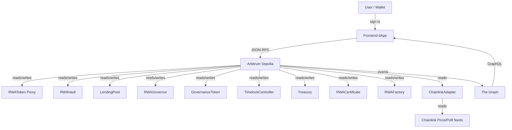
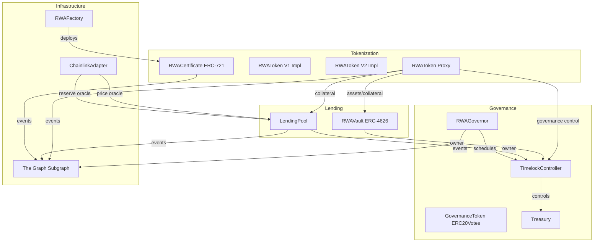
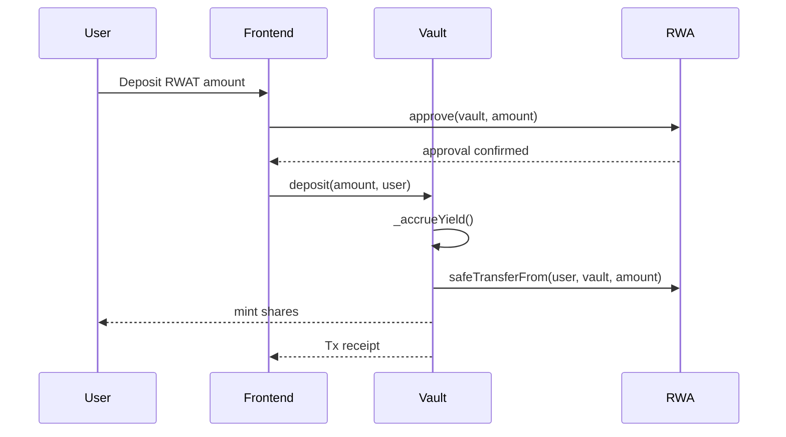
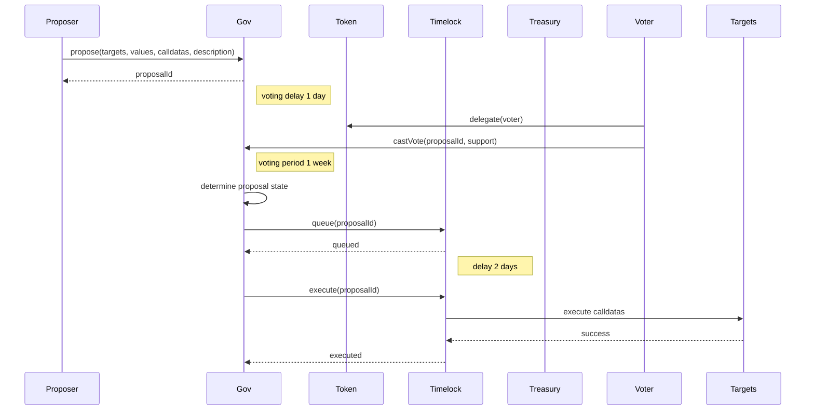
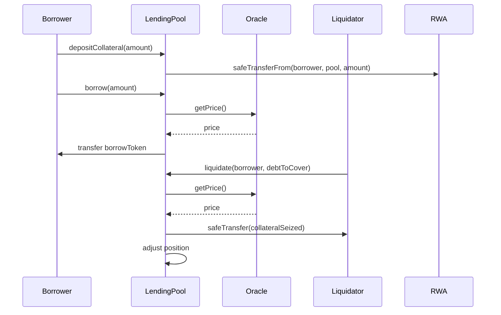
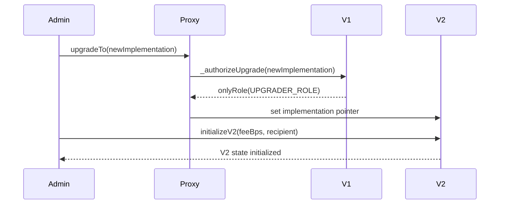

# Architecture Document

## 1. Project Overview

This document describes the architecture of the Final Project: a Real-World Asset (RWA) Tokenization Platform built as a full-stack decentralized protocol on Arbitrum Sepolia. The implementation includes a UUPS-upgradeable ERC-20 token, a tokenized ERC-4626 vault, a custom lending pool, Chainlink oracle integration, a DAO governance stack, a factory contract, and a subgraph for indexing protocol state.

The platform is designed for Option C: RWA Tokenization Platform.

Key components:
- `RWAToken` (UUPS upgradeable ERC-20)
- `RWATokenV2` upgrade path
- `GovernanceToken` (ERC20Votes + ERC20Permit)
- `RWACertificate` (ERC-721 asset certificate)
- `RWAVault` (ERC-4626 tokenized yield vault)
- `LendingPool` (custom lending pool with LTV, health factor, liquidation, linear interest)
- `ChainlinkAdapter` (oracle adapter with stale data checks)
- `RWAGovernor` + `TimelockController` + `Treasury`
- `RWAFactory` (CREATE and CREATE2 certificate deployment)
- Subgraph indexed data and frontend integration

## 2. System Context

The protocol sits between users, the Ethereum execution environment, external oracle providers, and indexing services.

### External Dependencies
- Chainlink price feed and proof-of-reserve feed
- Arbitrum Sepolia RPC / explorer
- The Graph indexing service
- MetaMask wallet for frontend signing

## 3. Container / Component Diagram

The contract-based architecture is organized into four major domains: tokenization, lending, governance, and infrastructure.

### Component Responsibilities
- `RWAToken`: tokenizes real-world collateral with upgradeability, mint/burn, pause, and reserve metadata.
- `RWATokenV2`: upgrade extension adding transfer fee and whitelist control.
- `RWACertificate`: ERC-721 certificate NFT representing off-chain asset claims.
- `RWAVault`: ERC-4626 vault for depositors with yield accrual and precise rounding.
- `LendingPool`: custom lending primitive with collateralized borrowing, liquidation, LP deposit, and interest index.
- `GovernanceToken`: DAO voting token with permit support for gasless approvals.
- `RWAGovernor`: OpenZeppelin governor implementing proposal lifecycle, quorum, and timelock control.
- `TimelockController`: delay execution of protocol-critical governance actions.
- `Treasury`: secure asset custody and pull-based allocations.
- `ChainlinkAdapter`: oracle adapter and staleness guard for price and PoR data.
- `RWAFactory`: deploys certificate contracts deterministically and non-deterministically.
- `The Graph`: indexes contract events and exposes protocol analytics.

## 4. Sequence Diagrams

### 4.1 Vault Deposit Flow

### 4.2 Governance Proposal Lifecycle

### 4.3 Lending Borrow + Liquidation Flow

### 4.4 Upgrade Flow: RWAToken V1 → V2

## 5. Data Model and Storage Layout

### 5.1 RWAToken / RWATokenV2 Storage Layout

`RWAToken` uses `ERC20Upgradeable` and custom storage in a deterministic slot.

Fields:
- `MINTER_ROLE`, `PAUSER_ROLE`, `UPGRADER_ROLE`
- `RWAStorage`: `backingAsset`, `reserveRatioBps`, `assetDescription`

`RWATokenV2` adds `V2Storage` after V1 storage:
- `transferFeeBps`
- `feeRecipient`
- `whitelistEnabled`
- `whitelist`

Storage safety is preserved by placing new state in a separate custom slot. The upgrade path uses `initializeV2` to set V2-specific state.

### 5.2 LendingPool Storage Layout

- `collateralToken` (immutable)
- `borrowToken` (immutable)
- `oracle`
- `positions` mapping(address => Position)
- `totalCollateral`
- `totalScaledDebt`
- `totalLiquidity`
- `debtIndex`
- `lastUpdateTs`

Position struct:
- `collateral`
- `scaledDebt`

### 5.3 RWAVault Storage Layout

Inherited from `ERC4626` and `ERC20` plus:
- `yieldRatePerSecond`
- `lastYieldTimestamp`
- `pendingYield`

These fields enable deterministic yield accrual and correct share accounting.

### 5.4 Governance Storage Layout

Governor stack is inherited from OpenZeppelin Governor contracts. Key protocol-owned storage is in:
- `TimelockController` — delay configuration, proposer/executor/canceller roles
- `Treasury` — claimable allocations and ETH balance
- `GovernanceToken` — checkpoints and delegation history

## 6. Trust Assumptions

### 6.1 On-chain trust boundaries
- `TimelockController` is the ultimate protocol administrator for `RWAVault`, `LendingPool`, and `GovernanceToken`.
- `GovernanceToken` owners may propose protocol changes via the governor after meeting proposal threshold.
- `Treasury` funds can only be disbursed by governance-executed actions.
- `ChainlinkAdapter` owner can update oracle feeds. In a production deployment, this owner should be a multisig or governor-managed address.

### 6.2 Adversarial assumptions
- A malicious user cannot bypass `AccessControl` or `Ownable` roles without private keys.
- Reentrancy is prevented in all external state-changing paths that transfer assets.
- Price feed staleness is enforced to prevent stale oracle manipulation.
- Governance actions are delayed by the Timelock, enabling stakeholders to respond to dangerous proposals.

### 6.3 Compromise scenarios
- If Timelock admin keys are compromised, attacker can execute queued proposals. The 2-day delay provides an opportunity to veto if governance can act quickly.
- If Chainlink price feed data is corrupted, the `ChainlinkAdapter` will reject stale or invalid rounds, but a bad live feed can still misprice collateral temporarily.
- If the deployer retains `UPGRADER_ROLE` on `RWAToken`, token logic can be upgraded; this role should also be governed or timelocked.

## 7. Architecture Decision Records (ADRs)

### ADR 1: Choose Option C — RWA Tokenization Platform
- **Context:** Course requires one of five scenarios.
- **Decision:** Option C was chosen to combine tokenization, lending, governance, oracle, and indexing domains.
- **Consequences:** Implementation includes ERC-20, ERC-721, ERC-4626, Chainlink, custom lending, and DAO governance.

### ADR 2: Use UUPS for token upgradeability
- **Context:** Project requires at least one upgradeable contract with documented V1→V2 path.
- **Decision:** `RWAToken` uses UUPSUpgradeable and custom storage slots for V2.
- **Consequences:** Upgrade risk is concentrated in `UPGRADER_ROLE`, requiring strong governance control.

### ADR 3: Build lending primitive from scratch
- **Context:** Requirement is to implement one DeFi primitive from scratch.
- **Decision:** `LendingPool` was designed with LTV, health factor, liquidation, and linear interest.
- **Consequences:** This avoids AMM replication and provides a unique RWA lending flow.

### ADR 4: Implement Chainlink adapter interface
- **Context:** Oracle integration must be abstracted for easy testing and replacement.
- **Decision:** `ChainlinkAdapter` implements `IChainlinkAdapter` and exposes normalized price/reserve values.
- **Consequences:** Lending pool depends on adapter interface, making tests and potential feed swaps easier.

### ADR 5: Use Timelock + Governor for critical control
- **Context:** Governance must control treasury and protocol upgrades.
- **Decision:** `RWAGovernor` + `TimelockController` + `Treasury` were used to enforce delay and execution flow.
- **Consequences:** Protocol changes require full propose→vote→queue→execute lifecycle, improving decentralization.
